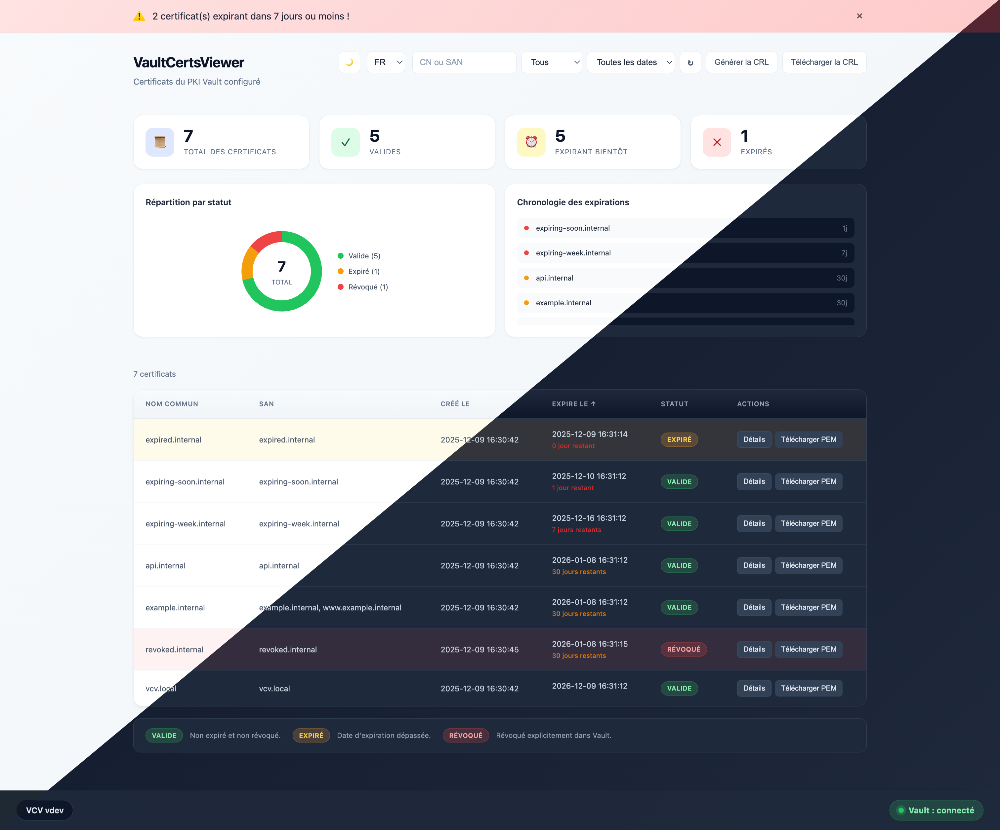
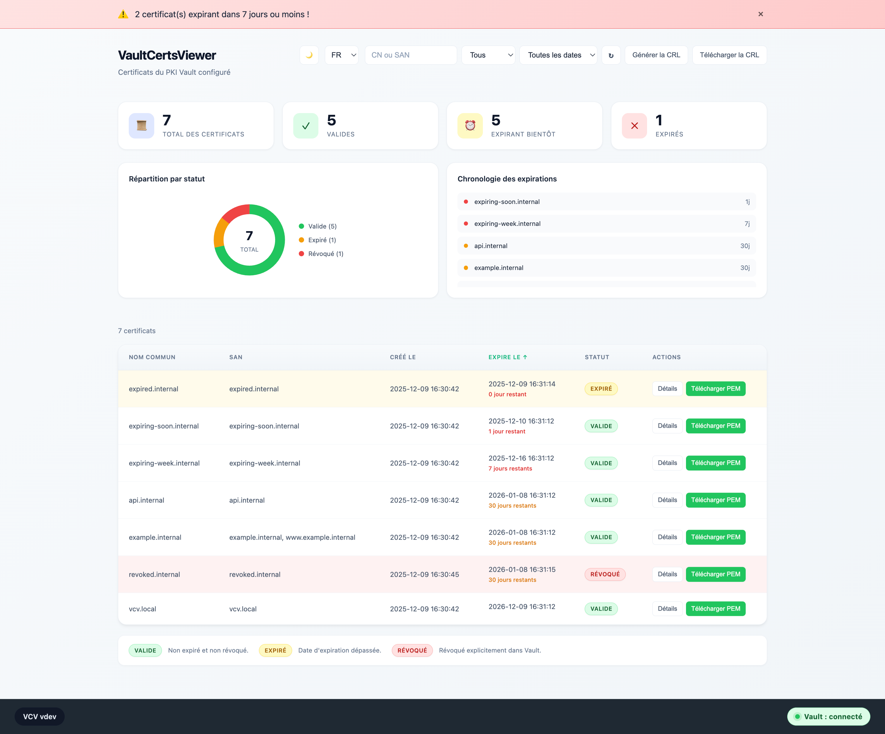
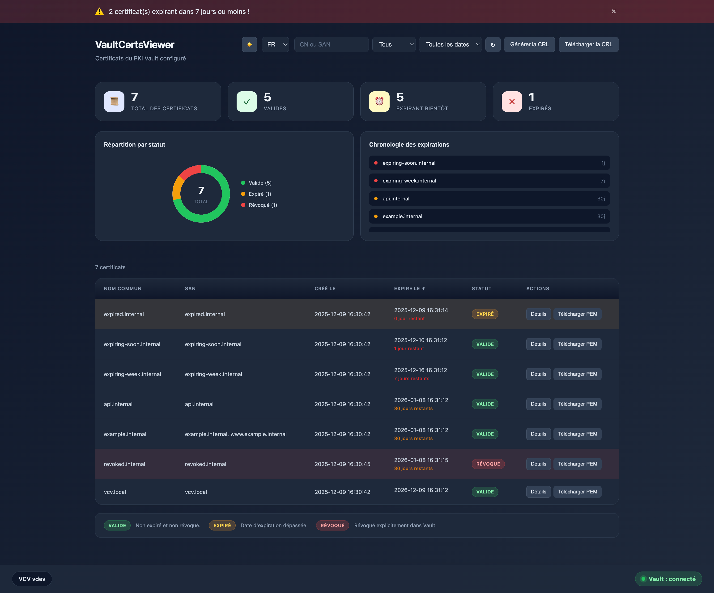

# VaultCertsViewer

VaultCertsViewer (vcv) est une interface web légère qui permet de lister et de consulter les certificats stockés dans un coffre ‘pki’ d'HashiCorp Vault. Elle affiche notamment les noms communs, les SAN et surtout les dates d'expiration des certificats.

Actuellement, VaultCertsViewer (vcv) ne peut voir et afficher les certificats que d'un seul montage à la fois. Si vous avez (par exemple) 4 montages, il vous faudra déployer 4 instances de vcv.

## Quelles sont les fonctionnalités ?

- Découvre tous les certificats d’une PKI dans Vault et les affiche dans un tableau filtrable et recherchable.
- Affichage des noms communs (CN) et des SANs des certificats.
- Affiche la répartition des statuts (valide / expiré / révoqué) et les dates d'expirations à venir.
- Met en avant les certificats qui expirent bientôt (7/30 jours) et affiche les détails (CN, SAN, empreintes, émetteur, validité).
- Choix de la langue de l’UI (en, fr, es, de, it) et le thème (clair/sombre).

## Pourquoi cet outil existe-t-il ?

L'interface de Vault est trop lourde et complexe pour consulter les certificats. Elle ne permet pas **facilement** et rapidement de consulter les dates d'expiration et les détails des certificats.

VaultCertsViewer permet aux équipes plateforme / sécurité / ops une vue rapide et en **lecture seule** sur l’inventaire PKI Vault avec les seules informations nécessaires et utiles.

## À qui s'adresse-t-il ?

- Aux equipes exploitant l'outil Vault PKI qui ont besoin de visibilité sur leurs certificats.
- Aux opérateurs qui veulent une vue navigateur prête à l’emploi, à côté de la CLI ou de la Web UI de Vault.

## Comment le déployer et l'utiliser ?

Dans HashiCorp Vault, créez un rôle et un jeton en lecture seule pour l'API afin d'accéder aux certificats du moteur PKI ciblé (adaptez `pki` si vous utilisez un autre point de montage) :

```bash
vault policy write vcv - <<'EOF'
path "pki/certs"    { capabilities = ["list"] }
path "pki/certs/*"  { capabilities = ["read","list"] }
path "sys/health"   { capabilities = ["read"] }
EOF
vault write auth/token/roles/vcv allowed_policies="vcv" orphan=true period="24h"
vault token create -role="vcv" -policy="vcv" -period="24h" -renewable=true
```

Ce jeton dédié limite les droits à la consultation des certificats, peut être renouvelé et sert de valeur `VAULT_READ_TOKEN` pour l'application.

### docker-compose

Récupérez le fichier `docker-compose.yml`, placez-le dans un répertoire de votre machine, et créez un fichier `.env` avec les variables suivantes.

```text
VAULT_ADDR=<you vault address>
VAULT_READ_TOKEN=<previously generated token>
VAULT_PKI_MOUNT=<pki engine name>
```

Lancez ensuite la commande suivante :

```bash
docker compose up -d
```

Il n'y a pas besoin de stockage, sauf si vous souhaitez envoyer les journaux d'événements dans un fichier.

### docker run

Lancez rapidement le container avec cette commande:

```bash
docker run -d \
  -e "VAULT_ADDR=http://changeme:8200" \
  -e "VAULT_READ_TOKEN=changeme" \
  -e "VAULT_PKI_MOUNT=changeme" \
  -e "LOG_LEVEL=info" \
  -e "LOG_FORMAT=json" \
  -e "LOG_OUTPUT=stdout" \
  --cap-drop=ALL --read-only --security-opt no-new-privileges:true \
  -p 52000:52000 jhmmt/vcv:1.1
```

## Multilingue

L’UI est localisée en anglais, français, espagnol, allemand et italien. La langue se choisit dans l’en-tête ou via `?lang=xx`.

## Exporter des métriques vers Prometheus

Les métriques sont exposées sur l’endpoint `/metrics`.

- vcv_cache_size
- vcv_certificate_expiry_timestamp_seconds{serial_number, common_name, status}
- vcv_certificate_exporter_last_scrape_success
- vcv_certificates_expired_count
- vcv_certificates_last_fetch_timestamp_seconds
- vcv_certificates_total{status}
- vcv_vault_connected

Pour configurer le scraping côté Prometheus :

```yaml
scrape_configs:
  - job_name: vcv
    static_configs:
      - targets: ['localhost:52000']
    metrics_path: /metrics
```

Example scrape output (truncated):

```bash
$ curl -v http://localhost:52000/metrics
...
# HELP vcv_cache_size Number of items currently cached
# TYPE vcv_cache_size gauge
vcv_cache_size 0
# HELP vcv_certificate_expiry_timestamp_seconds Certificate expiration timestamp in seconds since epoch
# TYPE vcv_certificate_expiry_timestamp_seconds gauge
vcv_certificate_expiry_timestamp_seconds{common_name="api.internal",serial_number="52:e3:c0:23:ba:f4:51:ae:1b:59:24:4a:d1:03:e1:a7:8a:96:a7:80",status="active"} 1.767710142e+09
vcv_certificate_expiry_timestamp_seconds{common_name="example.internal",serial_number="35:1b:ff:d3:e2:f3:53:14:b1:7f:9e:d3:77:a6:25:72:a2:63:15:99",status="active"} 1.767710142e+09
vcv_certificate_expiry_timestamp_seconds{common_name="expired.internal",serial_number="74:5a:ed:76:98:b1:c8:e3:d7:a5:bb:a2:67:7f:f6:4f:2a:31:48:18",status="active"} 1.765118144e+09
vcv_certificate_expiry_timestamp_seconds{common_name="expiring-soon.internal",serial_number="36:c6:0b:ef:2c:a5:2f:08:89:6a:13:fe:2a:9e:43:84:38:a4:a9:af",status="active"} 1.765204542e+09
vcv_certificate_expiry_timestamp_seconds{common_name="expiring-week.internal",serial_number="47:c9:8f:71:2a:d7:14:49:96:64:af:d6:15:ec:e9:86:a6:59:cf:26",status="active"} 1.765722942e+09
vcv_certificate_expiry_timestamp_seconds{common_name="revoked.internal",serial_number="2d:08:41:de:10:5a:21:0e:63:0d:5d:8e:f9:4e:ce:4b:7b:31:2e:2d",status="revoked"} 1.767710145e+09
vcv_certificate_expiry_timestamp_seconds{common_name="vcv.local",serial_number="48:88:7a:6a:65:85:85:8b:0a:2a:12:7f:a7:6f:dc:62:3a:f2:7a:ba",status="active"} 1.796654141e+09
# HELP vcv_certificate_exporter_last_scrape_success Whether the last scrape succeeded (1) or failed (0)
# TYPE vcv_certificate_exporter_last_scrape_success gauge
vcv_certificate_exporter_last_scrape_success 1
# HELP vcv_certificates_expired_count Number of expired certificates
# TYPE vcv_certificates_expired_count gauge
vcv_certificates_expired_count 1
# HELP vcv_certificates_expires_soon_count Number of certificates expiring soon within threshold window
# TYPE vcv_certificates_expires_soon_count gauge
vcv_certificates_expires_soon_count 4
# HELP vcv_certificates_last_fetch_timestamp_seconds Timestamp of last successful certificates fetch
# TYPE vcv_certificates_last_fetch_timestamp_seconds gauge
vcv_certificates_last_fetch_timestamp_seconds 1.765118171e+09
# HELP vcv_certificates_total Total certificates grouped by status
# TYPE vcv_certificates_total gauge
vcv_certificates_total{status="active"} 6
vcv_certificates_total{status="revoked"} 1
# HELP vcv_vault_connected Vault connection status (1=connected,0=disconnected)
# TYPE vcv_vault_connected gauge
vcv_vault_connected 1
```

Si vous utilisez AlertManager, vous pouvez créer des alertes à partir de ces métriques. Par exemple, en ne vous basant que sur le timestamp d’expiration et les compteurs génériques :

```yaml
- alert: VCVExpiredCerts
  expr: vcv_certificates_expired_count > 0

- alert: VCVExpiringSoon_14d
  expr: (vcv_certificate_expiry_timestamp_seconds - time()) / 86400 < 14

- alert: VCVStaleData
  expr: time() - vcv_certificates_last_fetch_timestamp_seconds > 3600

- alert: VCVVaultDown
  expr: vcv_vault_connected == 0
```

Vous pouvez adapter librement la fenêtre « bientôt » (ici 14 jours) directement dans vos requêtes PromQL, sans modifier l’exporter.

## Pour aller plus loin

- Documentation technique : [app/README.md](app/README.md)
- Version anglaise : [README.md](README.md)

## Picture of the app






