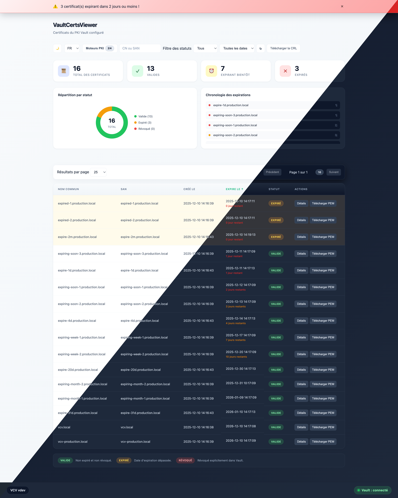
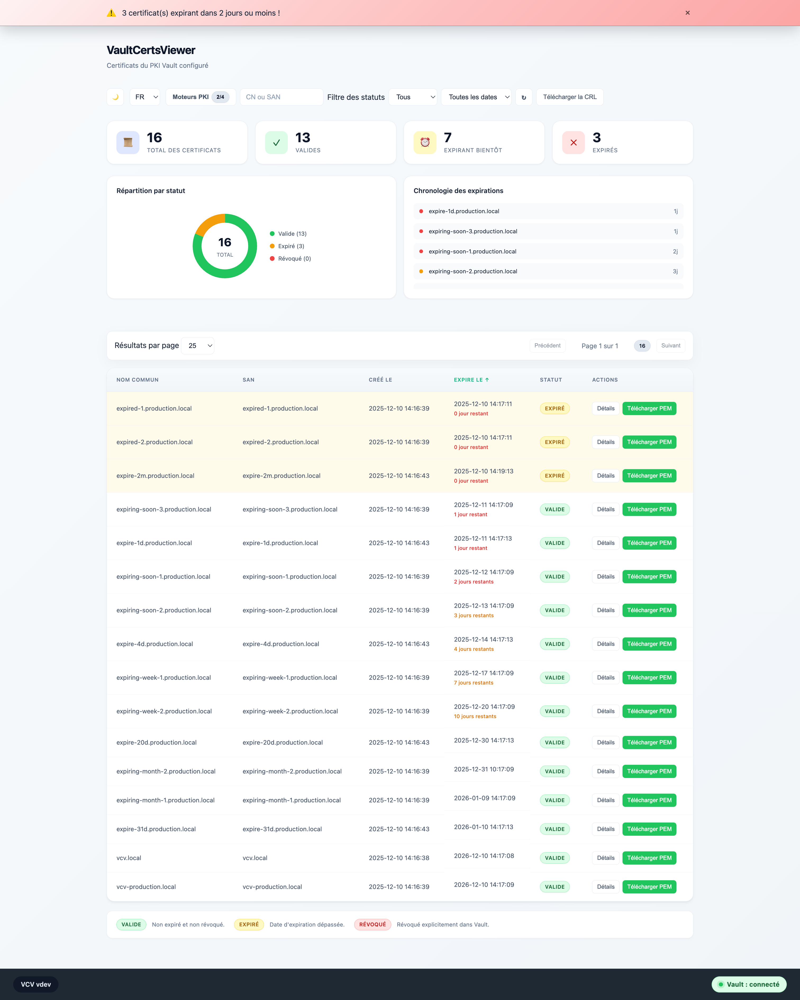
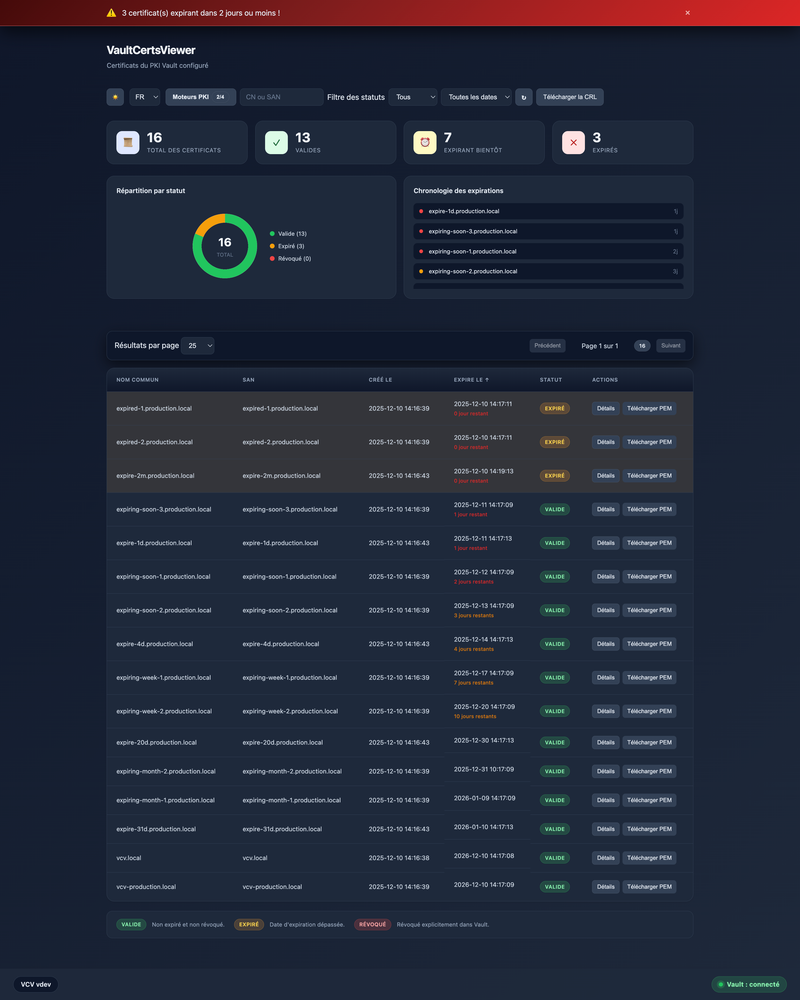

# VaultCertsViewer 🔐

VaultCertsViewer (vcv) is a lightweight web UI that lists and inspects certificates stored in one or more HashiCorp Vault PKI mounts, especially their expiration dates and SANs.

VaultCertsViewer can simultaneously monitor multiple PKI engines through a single interface, with a modal selector to choose which mounts to display. With its `settings.json` file configuration, VCV can connect to multiple Vault instances and PKI mounts.

## ✨ What it does

- Discovers all certificates in one or more Vault PKI mounts and shows them in a searchable, filterable table.
- Multi-PKI engine support: Select which mounts to display via an intuitive modal interface with real-time certificate count badges.
- Shows common names (CN) and SANs.
- Displays status distribution (valid / expired / revoked) and upcoming expirations.
- Highlights certificates expiring soon (7/30 days) and shows details (CN, SAN, fingerprints, issuer, validity).
- Lets you pick UI language (en, fr, es, de, it) and theme (light/dark).
- Real-time Vault connection status with toast notifications when connection is lost/restored.

## 🎯 Why it exists

The native Vault UI is heavy and not convenient for quickly checking certificate expirations and details. VaultCertsViewer gives platform / security / ops teams a fast, **read-only** view of the Vault PKI inventory with only the essential information.

## 👥 Who should use it

- Teams operating Vault PKI who need visibility on their certificates.
- Operators who want a ready-to-use browser view alongside Vault CLI or Web UI.

## 🚀 How to deploy and use

In HashiCorp Vault, create a read-only role and token for the API to reach the target PKI engines. For multiple mounts, you can either specify each mount explicitly or use wildcard patterns:

```bash
# Option 1: Explicit mounts (recommended for production). Replace 'pki' and 'pki2' with your actual mount names.
vault policy write vcv - <<'EOF'
path "pki/certs"    { capabilities = ["list"] }
path "pki/certs/*"  { capabilities = ["read","list"] }
path "pki2/certs"   { capabilities = ["list"] }
path "pki2/certs/*" { capabilities = ["read","list"] }
path "sys/health"   { capabilities = ["read"] }
EOF

# Option 2: Wildcard pattern (for dynamic environments)
vault policy write vcv - <<'EOF'
path "pki*/certs"    { capabilities = ["list"] }
path "pki*/certs/*"  { capabilities = ["read","list"] }
path "sys/health"     { capabilities = ["read"] }
EOF

vault write auth/token/roles/vcv allowed_policies="vcv" orphan=true period="24h"
vault token create -role="vcv" -policy="vcv" -period="24h" -renewable=true
```

This dedicated token limits permissions to certificate listing/reading, can be renewed, and is used as `VAULT_READ_TOKEN` by the app.

## 🧩 Multi-PKI engine support

VaultCertsViewer can monitor multiple PKI engines simultaneously through a single web interface:

- **Mount selection**: Click the mount selector button in the header to open a modal showing all available PKI engines
- **Real-time counts**: Each mount displays a badge showing the number of certificates it contains
- **Flexible configuration**: Specify mounts using comma-separated values in `VAULT_PKI_MOUNTS` (e.g., `pki,pki2,pki-prod`)
- **Independent views**: Select or deselect any combination of mounts to customize your certificate view
- **Dashboard**: All selected mounts are aggregated in the same table, dashboard, and metrics
- **Real-time search**: Instant filtering as you type in the search box with 300ms debouncing
- **Status filtering**: Quick filters for valid/expired/revoked certificates
- **Expiry timeline**: Visual timeline showing certificate expiration distribution
- **Pagination**: Configurable page size (25/50/75/100/all) with navigation controls
- **Sort options**: Sort by common name, expiration date, or serial number

This approach eliminates the need to deploy multiple vcv instances when you have several PKI engines to monitor.

### 🐳 docker-compose

The recommended way to configure vcv is via a `settings.json` file.

1. Copy the example file and edit it:

```bash
cp settings.example.json settings.json
```

1. Mount it into the container under `/app/settings.json` and start:

```bash
docker compose up -d
```

If you set `app.logging.output` to `file` or `both`, you must mount a writable log path:

```bash
-v "$(pwd)/logs:/var/log/app:rw"
```

### 🐳 docker run

Start the container with this command:

```bash
docker run -d \
  -v "$(pwd)/settings.json:/app/settings.json:rw" \
  -v "$(pwd)/logs:/var/log/app:rw" \
  --cap-drop=ALL --read-only --security-opt no-new-privileges:true \
  -p 52000:52000 jhmmt/vcv:1.3
```

## ⏱️ Certificate expiration thresholds

By default, VaultCertsViewer alerts on certificates expiring within **7 days** (critical) and **30 days** (warning). You can customize these thresholds in `settings.json` under `certificates.expiration_thresholds`.

```text
"certificates": {
  "expiration_thresholds": {
    "critical": 14,
    "warning": 60
  }
}
```

Legacy environment variables (`VCV_EXPIRE_CRITICAL`, `VCV_EXPIRE_WARNING`) are still supported as a fallback.

These values control:

- The notification banner at the top of the page
- The color coding in the certificate table (red for critical, yellow for warning)
- The timeline visualization on the dashboard
- The "expiring soon" count in the dashboard

## 🌍 Translations

The UI is localized in English, French, Spanish, German, and Italian. Language is selectable in the header or via `?lang=xx`.

## 📊 Export metrics to Prometheus

Metrics are exposed at `/metrics` endpoint.

- vcv_cache_size
- vcv_certificate_expiry_timestamp_seconds{serial_number, common_name, status}
- vcv_certificate_exporter_last_scrape_success
- vcv_certificates_expired_count
- vcv_certificates_expires_soon_count Number of certificates expiring soon within threshold window
- vcv_certificates_last_fetch_timestamp_seconds
- vcv_certificates_total{status}
- vcv_vault_connected

To scrape metrics, add this to your Prometheus config:

```yaml
scrape_configs:
  - job_name: vcv
    static_configs:
      - targets: ['localhost:52000']
    metrics_path: /metrics
```

Example scrape output (truncated):

```bash
$ curl -v http://localhost:52000/metrics
...
# HELP vcv_cache_size Number of items currently cached
# TYPE vcv_cache_size gauge
vcv_cache_size 0
# HELP vcv_certificate_expiry_timestamp_seconds Certificate expiration timestamp in seconds since epoch
# TYPE vcv_certificate_expiry_timestamp_seconds gauge
vcv_certificate_expiry_timestamp_seconds{common_name="api.internal",serial_number="52:e3:c0:23:ba:f4:51:ae:1b:59:24:4a:d1:03:e1:a7:8a:96:a7:80",status="active"} 1.767710142e+09
vcv_certificate_expiry_timestamp_seconds{common_name="example.internal",serial_number="35:1b:ff:d3:e2:f3:53:14:b1:7f:9e:d3:77:a6:25:72:a2:63:15:99",status="active"} 1.767710142e+09
vcv_certificate_expiry_timestamp_seconds{common_name="expired.internal",serial_number="74:5a:ed:76:98:b1:c8:e3:d7:a5:bb:a2:67:7f:f6:4f:2a:31:48:18",status="active"} 1.765118144e+09
vcv_certificate_expiry_timestamp_seconds{common_name="expiring-soon.internal",serial_number="36:c6:0b:ef:2c:a5:2f:08:89:6a:13:fe:2a:9e:43:84:38:a4:a9:af",status="active"} 1.765204542e+09
vcv_certificate_expiry_timestamp_seconds{common_name="expiring-week.internal",serial_number="47:c9:8f:71:2a:d7:14:49:96:64:af:d6:15:ec:e9:86:a6:59:cf:26",status="active"} 1.765722942e+09
vcv_certificate_expiry_timestamp_seconds{common_name="revoked.internal",serial_number="2d:08:41:de:10:5a:21:0e:63:0d:5d:8e:f9:4e:ce:4b:7b:31:2e:2d",status="revoked"} 1.767710145e+09
vcv_certificate_expiry_timestamp_seconds{common_name="vcv.local",serial_number="48:88:7a:6a:65:85:85:8b:0a:2a:12:7f:a7:6f:dc:62:3a:f2:7a:ba",status="active"} 1.796654141e+09
# HELP vcv_certificate_exporter_last_scrape_success Whether the last scrape succeeded (1) or failed (0)
# TYPE vcv_certificate_exporter_last_scrape_success gauge
vcv_certificate_exporter_last_scrape_success 1
# HELP vcv_certificates_expired_count Number of expired certificates
# TYPE vcv_certificates_expired_count gauge
vcv_certificates_expired_count 1
# HELP vcv_certificates_expires_soon_count Number of certificates expiring soon within threshold window
# TYPE vcv_certificates_expires_soon_count gauge
vcv_certificates_expires_soon_count 4
# HELP vcv_certificates_last_fetch_timestamp_seconds Timestamp of last successful certificates fetch
# TYPE vcv_certificates_last_fetch_timestamp_seconds gauge
vcv_certificates_last_fetch_timestamp_seconds 1.765118171e+09
# HELP vcv_certificates_total Total certificates grouped by status
# TYPE vcv_certificates_total gauge
vcv_certificates_total{status="active"} 6
vcv_certificates_total{status="revoked"} 1
# HELP vcv_vault_connected Vault connection status (1=connected,0=disconnected)
# TYPE vcv_vault_connected gauge
vcv_vault_connected 1
```

If you are using AlertManager, you can create alerts based on these metrics. For example, using only the expiry timestamp and generic counters:

```yaml
- alert: VCVExpiredCerts
  expr: vcv_certificates_expired_count > 0

- alert: VCVExpiringSoon_14d
  expr: (vcv_certificate_expiry_timestamp_seconds - time()) / 86400 < 14

- alert: VCVStaleData
  expr: time() - vcv_certificates_last_fetch_timestamp_seconds > 3600

- alert: VCVVaultDown
  expr: vcv_vault_connected == 0
```

You can adjust the "soon" window (here 14 days) directly in PromQL without changing the exporter.

## 🔎 More details

- Technical documentation: [app/README.md](app/README.md)
- French overview: [README.fr.md](README.fr.md)
- Docker hub: [jhmmt/vcv](https://hub.docker.com/r/jhmmt/vcv)
- Source code: [github.com/julienhmmt/vcv](https://github.com/julienhmmt/vcv)

## 🖼️ Picture of the app






