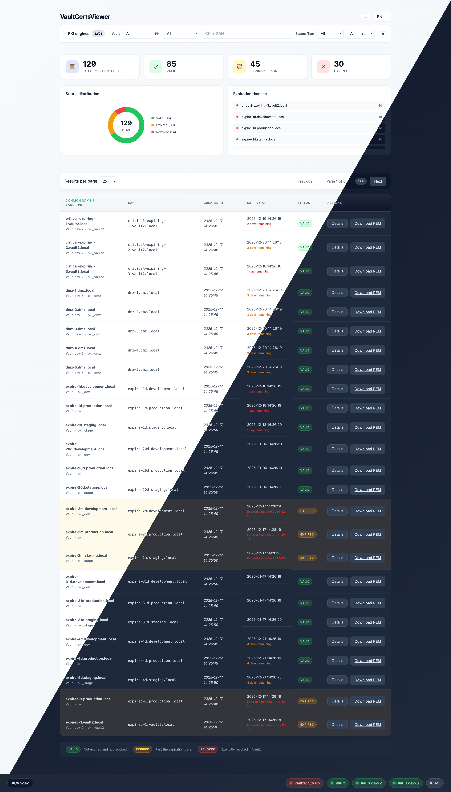
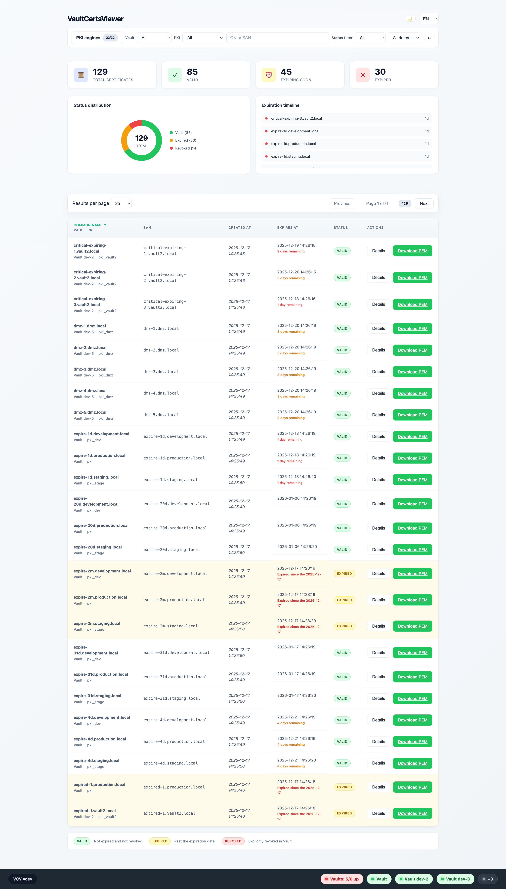
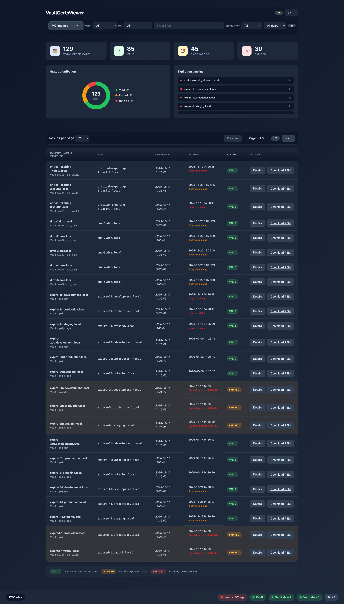

# VaultCertsViewer 🔐

VaultCertsViewer (vcv) is a lightweight web UI that lists and inspects certificates stored in one or more HashiCorp Vault PKI mounts, especially their expiration dates and SANs.

VaultCertsViewer can simultaneously monitor multiple PKI engines through a single interface, with a modal selector to choose which mounts to display. With its `settings.json` file configuration, VCV can connect to multiple Vault instances and PKI mounts.

## ✨ What it does

- Discovers all certificates in one or more Vault PKI mounts and shows them in a searchable, filterable table.
- Multi-PKI engine support: Select which mounts to display via an intuitive modal interface with real-time certificate count badges.
- Shows common names (CN) and SANs.
- Displays status distribution (valid / expired / revoked) and upcoming expirations.
- Highlights certificates expiring soon (7/30 days) and shows details (CN, SAN, fingerprints, issuer, validity).
- Lets you pick UI language (en, fr, es, de, it) and theme (light/dark).
- Real-time Vault connection status with toast notifications when connection is lost/restored.

## 🎯 Why it exists

The native Vault UI is heavy and not convenient for quickly checking certificate expirations and details. VaultCertsViewer gives platform / security / ops teams a fast, **read-only** view of the Vault PKI inventory with only the essential information.

## 👥 Who should use it

- Teams operating Vault PKI who need visibility on their certificates.
- Operators who want a ready-to-use browser view alongside Vault CLI or Web UI.

## 🚀 How to deploy and use

In HashiCorp Vault, create a read-only role and token for the API to reach the target PKI engines. For multiple mounts, you can either specify each mount explicitly or use wildcard patterns:

```bash
# Option 1: Explicit mounts (recommended for production). Replace 'pki' and 'pki2' with your actual mount names.
vault policy write vcv - <<'EOF'
path "pki/certs"    { capabilities = ["list"] }
path "pki/certs/*"  { capabilities = ["read","list"] }
path "pki2/certs"   { capabilities = ["list"] }
path "pki2/certs/*" { capabilities = ["read","list"] }
path "sys/health"   { capabilities = ["read"] }
EOF

# Option 2: Wildcard pattern (for dynamic environments)
vault policy write vcv - <<'EOF'
path "pki*/certs"    { capabilities = ["list"] }
path "pki*/certs/*"  { capabilities = ["read","list"] }
path "sys/health"     { capabilities = ["read"] }
EOF

vault write auth/token/roles/vcv allowed_policies="vcv" orphan=true period="24h"
vault token create -role="vcv" -policy="vcv" -period="24h" -renewable=true
```

This dedicated token limits permissions to certificate listing/reading, can be renewed, and is used as `VAULT_READ_TOKEN` by the app.

## 🧩 Multi-PKI engine support

VaultCertsViewer can monitor multiple PKI engines simultaneously through a single web interface:

- **Mount selection**: Click the mount selector button in the header to open a modal showing all available PKI engines
- **Real-time counts**: Each mount displays a badge showing the number of certificates it contains
- **Flexible configuration**: Specify mounts using comma-separated values in `VAULT_PKI_MOUNTS` (e.g., `pki,pki2,pki-prod`)
- **Independent views**: Select or deselect any combination of mounts to customize your certificate view
- **Dashboard**: All selected mounts are aggregated in the same table, dashboard, and metrics
- **Real-time search**: Instant filtering as you type in the search box with 300ms debouncing
- **Status filtering**: Quick filters for valid/expired/revoked certificates
- **Expiry timeline**: Visual timeline showing certificate expiration distribution
- **Pagination**: Configurable page size (25/50/75/100/all) with navigation controls
- **Sort options**: Sort by common name, expiration date, or serial number

This approach eliminates the need to deploy multiple vcv instances when you have several PKI engines to monitor.

### 🐳 docker-compose

The recommended way to configure vcv is via a `settings.json` file.

1. Copy the example file and edit it:

```bash
cp settings.example.json settings.json
```

1. Mount it into the container under `/app/settings.json` and start:

```bash
docker compose up -d
```

If you set `app.logging.output` to `file` or `both`, you must mount a writable log path:

```bash
-v "$(pwd)/logs:/var/log/app:rw"
```

### 🐳 docker run

Start the container with this command:

```bash
docker run -d \
  -v "$(pwd)/settings.json:/app/settings.json:rw" \
  -v "$(pwd)/logs:/var/log/app:rw" \
  --cap-drop=ALL --read-only --security-opt no-new-privileges:true \
  -p 52000:52000 jhmmt/vcv:1.4
```

## 🔐 Vault TLS configuration

VCV supports configuring Vault TLS verification and custom CA bundles either through `settings.json` (recommended) or environment variables (legacy fallback).

Per Vault instance (`vaults[]`), you can configure:

- **`tls_ca_cert_base64`**: base64-encoded PEM CA bundle (preferred)
- **`tls_ca_cert`**: file path to a PEM CA bundle
- **`tls_ca_path`**: directory containing CA certs
- **`tls_server_name`**: TLS SNI server name override
- **`tls_insecure`**: disables TLS verification (development only)

Precedence rules:

- If `tls_ca_cert_base64` is set, it is used and `tls_ca_cert` / `tls_ca_path` are ignored.
- Otherwise, `tls_ca_cert` / `tls_ca_path` are used (if set).

Notes:

- Base64 is not encryption. Treat your `settings.json` as sensitive.
- The base64 value must encode the PEM bytes (one or multiple `-----BEGIN CERTIFICATE-----` blocks). Both standard and raw base64 encodings are accepted.
- To encode a certificate with base64, do this: `cat path-to-cert.pem |base64 -w0`, get the result and type it into the field.

The administration panel (`/admin`, enabled by `VCV_ADMIN_PASSWORD`) lets you set these TLS fields per Vault.

## ⏱️ Certificate expiration thresholds

By default, VaultCertsViewer alerts on certificates expiring within **7 days** (critical) and **30 days** (warning). You can customize these thresholds in `settings.json` under `certificates.expiration_thresholds`.

```text
"certificates": {
  "expiration_thresholds": {
    "critical": 14,
    "warning": 60
  }
}
```

Legacy environment variables (`VCV_EXPIRE_CRITICAL`, `VCV_EXPIRE_WARNING`) are still supported as a fallback.

These values control:

- The notification banner at the top of the page
- The color coding in the certificate table (red for critical, yellow for warning)
- The timeline visualization on the dashboard
- The "expiring soon" count in the dashboard

## 🌍 Translations

The UI is localized in English, French, Spanish, German, and Italian. Language is selectable in the header or via `?lang=xx`.

## 📊 Export metrics to Prometheus

Metrics are exposed at `/metrics` endpoint.

- vcv_cache_size
- vcv_certificate_exporter_last_scrape_duration_seconds
- vcv_certificate_expiry_timestamp_seconds{certificate_id, common_name, status, vault_id, pki} (optional)
- vcv_certificate_exporter_last_scrape_success
- vcv_certificates_expired_count
- vcv_certificates_expiring_soon_count{vault_id, pki, level}
- vcv_certificates_last_fetch_timestamp_seconds
- vcv_certificates_total{vault_id, pki, status}
- vcv_vault_connected{vault_id}
- vcv_vault_list_certificates_success{vault_id}
- vcv_vault_list_certificates_error{vault_id}
- vcv_vault_list_certificates_duration_seconds{vault_id}
- vcv_certificates_partial_scrape{vault_id}
- vcv_vaults_configured
- vcv_pki_mounts_configured{vault_id}

To scrape metrics, add this to your Prometheus config:

```yaml
scrape_configs:
  - job_name: vcv
    static_configs:
      - targets: ['localhost:52000']
    metrics_path: /metrics
```

Example scrape output (truncated):

```bash
$ curl -v http://localhost:52000/metrics
...
# HELP vcv_cache_size Number of items currently cached
# TYPE vcv_cache_size gauge
vcv_cache_size 0
# HELP vcv_certificate_exporter_last_scrape_duration_seconds Duration of the last certificate scrape in seconds
# TYPE vcv_certificate_exporter_last_scrape_duration_seconds gauge
vcv_certificate_exporter_last_scrape_duration_seconds 0.000118208
# HELP vcv_certificate_exporter_last_scrape_success Whether the last scrape succeeded (1) or failed (0)
# TYPE vcv_certificate_exporter_last_scrape_success gauge
vcv_certificate_exporter_last_scrape_success 1
# HELP vcv_certificates_expired_count Number of expired certificates
# TYPE vcv_certificates_expired_count gauge
vcv_certificates_expired_count 30
# HELP vcv_certificates_expiring_soon_count Number of certificates expiring soon within threshold window
# TYPE vcv_certificates_expiring_soon_count gauge
vcv_certificates_expiring_soon_count{level="critical",pki="__all__",vault_id="__all__"} 17
vcv_certificates_expiring_soon_count{level="critical",pki="pki",vault_id="vault-main"} 3
vcv_certificates_expiring_soon_count{level="critical",pki="pki_blockchain",vault_id="vault-dev-3"} 0
vcv_certificates_expiring_soon_count{level="critical",pki="pki_cloud",vault_id="vault-dev-3"} 0
vcv_certificates_expiring_soon_count{level="critical",pki="pki_corporate",vault_id="vault-dev-2"} 0
vcv_certificates_expiring_soon_count{level="critical",pki="pki_dev",vault_id="vault-main"} 1
vcv_certificates_expiring_soon_count{level="critical",pki="pki_dmz",vault_id="vault-dev-5"} 0
vcv_certificates_expiring_soon_count{level="critical",pki="pki_edge",vault_id="vault-dev-3"} 0
vcv_certificates_expiring_soon_count{level="critical",pki="pki_external",vault_id="vault-dev-2"} 0
vcv_certificates_expiring_soon_count{level="critical",pki="pki_internal",vault_id="vault-dev-5"} 0
vcv_certificates_expiring_soon_count{level="critical",pki="pki_iot",vault_id="vault-dev-3"} 0
vcv_certificates_expiring_soon_count{level="critical",pki="pki_lab",vault_id="vault-dev-4"} 0
vcv_certificates_expiring_soon_count{level="critical",pki="pki_partners",vault_id="vault-dev-2"} 0
vcv_certificates_expiring_soon_count{level="critical",pki="pki_perf",vault_id="vault-dev-4"} 0
vcv_certificates_expiring_soon_count{level="critical",pki="pki_production",vault_id="vault-main"} 0
vcv_certificates_expiring_soon_count{level="critical",pki="pki_qa",vault_id="vault-dev-4"} 0
vcv_certificates_expiring_soon_count{level="critical",pki="pki_shared",vault_id="vault-dev-5"} 0
vcv_certificates_expiring_soon_count{level="critical",pki="pki_stage",vault_id="vault-main"} 1
vcv_certificates_expiring_soon_count{level="critical",pki="pki_vault2",vault_id="vault-dev-2"} 2
vcv_certificates_expiring_soon_count{level="critical",pki="pki_vault3",vault_id="vault-dev-3"} 2
vcv_certificates_expiring_soon_count{level="critical",pki="pki_vault4",vault_id="vault-dev-4"} 4
vcv_certificates_expiring_soon_count{level="critical",pki="pki_vault5",vault_id="vault-dev-5"} 4
vcv_certificates_expiring_soon_count{level="warning",pki="__all__",vault_id="__all__"} 45
vcv_certificates_expiring_soon_count{level="warning",pki="pki",vault_id="vault-main"} 7
vcv_certificates_expiring_soon_count{level="warning",pki="pki_blockchain",vault_id="vault-dev-3"} 0
vcv_certificates_expiring_soon_count{level="warning",pki="pki_cloud",vault_id="vault-dev-3"} 0
vcv_certificates_expiring_soon_count{level="warning",pki="pki_corporate",vault_id="vault-dev-2"} 0
vcv_certificates_expiring_soon_count{level="warning",pki="pki_dev",vault_id="vault-main"} 2
vcv_certificates_expiring_soon_count{level="warning",pki="pki_dmz",vault_id="vault-dev-5"} 5
vcv_certificates_expiring_soon_count{level="warning",pki="pki_edge",vault_id="vault-dev-3"} 0
vcv_certificates_expiring_soon_count{level="warning",pki="pki_external",vault_id="vault-dev-2"} 0
vcv_certificates_expiring_soon_count{level="warning",pki="pki_internal",vault_id="vault-dev-5"} 5
vcv_certificates_expiring_soon_count{level="warning",pki="pki_iot",vault_id="vault-dev-3"} 0
vcv_certificates_expiring_soon_count{level="warning",pki="pki_lab",vault_id="vault-dev-4"} 0
vcv_certificates_expiring_soon_count{level="warning",pki="pki_partners",vault_id="vault-dev-2"} 0
vcv_certificates_expiring_soon_count{level="warning",pki="pki_perf",vault_id="vault-dev-4"} 0
vcv_certificates_expiring_soon_count{level="warning",pki="pki_production",vault_id="vault-main"} 0
vcv_certificates_expiring_soon_count{level="warning",pki="pki_qa",vault_id="vault-dev-4"} 6
vcv_certificates_expiring_soon_count{level="warning",pki="pki_shared",vault_id="vault-dev-5"} 0
vcv_certificates_expiring_soon_count{level="warning",pki="pki_stage",vault_id="vault-main"} 2
vcv_certificates_expiring_soon_count{level="warning",pki="pki_vault2",vault_id="vault-dev-2"} 5
vcv_certificates_expiring_soon_count{level="warning",pki="pki_vault3",vault_id="vault-dev-3"} 5
vcv_certificates_expiring_soon_count{level="warning",pki="pki_vault4",vault_id="vault-dev-4"} 4
vcv_certificates_expiring_soon_count{level="warning",pki="pki_vault5",vault_id="vault-dev-5"} 4
# HELP vcv_certificates_last_fetch_timestamp_seconds Timestamp of last successful certificates fetch
# TYPE vcv_certificates_last_fetch_timestamp_seconds gauge
vcv_certificates_last_fetch_timestamp_seconds 1.765985686e+09
# HELP vcv_certificates_total Total certificates grouped by status
# TYPE vcv_certificates_total gauge
vcv_certificates_total{pki="__all__",status="expired",vault_id="__all__"} 30
vcv_certificates_total{pki="__all__",status="revoked",vault_id="__all__"} 14
vcv_certificates_total{pki="__all__",status="valid",vault_id="__all__"} 85
vcv_certificates_total{pki="pki",status="expired",vault_id="vault-main"} 3
vcv_certificates_total{pki="pki",status="revoked",vault_id="vault-main"} 0
vcv_certificates_total{pki="pki",status="valid",vault_id="vault-main"} 12
vcv_certificates_total{pki="pki_blockchain",status="expired",vault_id="vault-dev-3"} 0
vcv_certificates_total{pki="pki_blockchain",status="revoked",vault_id="vault-dev-3"} 1
vcv_certificates_total{pki="pki_blockchain",status="valid",vault_id="vault-dev-3"} 1
vcv_certificates_total{pki="pki_cloud",status="expired",vault_id="vault-dev-3"} 0
vcv_certificates_total{pki="pki_cloud",status="revoked",vault_id="vault-dev-3"} 1
vcv_certificates_total{pki="pki_cloud",status="valid",vault_id="vault-dev-3"} 1
vcv_certificates_total{pki="pki_corporate",status="expired",vault_id="vault-dev-2"} 0
vcv_certificates_total{pki="pki_corporate",status="revoked",vault_id="vault-dev-2"} 1
vcv_certificates_total{pki="pki_corporate",status="valid",vault_id="vault-dev-2"} 1
vcv_certificates_total{pki="pki_dev",status="expired",vault_id="vault-main"} 1
vcv_certificates_total{pki="pki_dev",status="revoked",vault_id="vault-main"} 2
vcv_certificates_total{pki="pki_dev",status="valid",vault_id="vault-main"} 5
vcv_certificates_total{pki="pki_dmz",status="expired",vault_id="vault-dev-5"} 0
vcv_certificates_total{pki="pki_dmz",status="revoked",vault_id="vault-dev-5"} 0
vcv_certificates_total{pki="pki_dmz",status="valid",vault_id="vault-dev-5"} 6
vcv_certificates_total{pki="pki_edge",status="expired",vault_id="vault-dev-3"} 0
vcv_certificates_total{pki="pki_edge",status="revoked",vault_id="vault-dev-3"} 1
vcv_certificates_total{pki="pki_edge",status="valid",vault_id="vault-dev-3"} 1
vcv_certificates_total{pki="pki_external",status="expired",vault_id="vault-dev-2"} 0
vcv_certificates_total{pki="pki_external",status="revoked",vault_id="vault-dev-2"} 1
vcv_certificates_total{pki="pki_external",status="valid",vault_id="vault-dev-2"} 1
vcv_certificates_total{pki="pki_internal",status="expired",vault_id="vault-dev-5"} 0
vcv_certificates_total{pki="pki_internal",status="revoked",vault_id="vault-dev-5"} 1
vcv_certificates_total{pki="pki_internal",status="valid",vault_id="vault-dev-5"} 6
vcv_certificates_total{pki="pki_iot",status="expired",vault_id="vault-dev-3"} 0
vcv_certificates_total{pki="pki_iot",status="revoked",vault_id="vault-dev-3"} 1
vcv_certificates_total{pki="pki_iot",status="valid",vault_id="vault-dev-3"} 1
vcv_certificates_total{pki="pki_lab",status="expired",vault_id="vault-dev-4"} 0
vcv_certificates_total{pki="pki_lab",status="revoked",vault_id="vault-dev-4"} 0
vcv_certificates_total{pki="pki_lab",status="valid",vault_id="vault-dev-4"} 7
vcv_certificates_total{pki="pki_partners",status="expired",vault_id="vault-dev-2"} 0
vcv_certificates_total{pki="pki_partners",status="revoked",vault_id="vault-dev-2"} 1
vcv_certificates_total{pki="pki_partners",status="valid",vault_id="vault-dev-2"} 1
vcv_certificates_total{pki="pki_perf",status="expired",vault_id="vault-dev-4"} 0
vcv_certificates_total{pki="pki_perf",status="revoked",vault_id="vault-dev-4"} 0
vcv_certificates_total{pki="pki_perf",status="valid",vault_id="vault-dev-4"} 1
vcv_certificates_total{pki="pki_production",status="expired",vault_id="vault-main"} 0
vcv_certificates_total{pki="pki_production",status="revoked",vault_id="vault-main"} 0
vcv_certificates_total{pki="pki_production",status="valid",vault_id="vault-main"} 1
vcv_certificates_total{pki="pki_qa",status="expired",vault_id="vault-dev-4"} 0
vcv_certificates_total{pki="pki_qa",status="revoked",vault_id="vault-dev-4"} 0
vcv_certificates_total{pki="pki_qa",status="valid",vault_id="vault-dev-4"} 7
vcv_certificates_total{pki="pki_shared",status="expired",vault_id="vault-dev-5"} 0
vcv_certificates_total{pki="pki_shared",status="revoked",vault_id="vault-dev-5"} 0
vcv_certificates_total{pki="pki_shared",status="valid",vault_id="vault-dev-5"} 6
vcv_certificates_total{pki="pki_stage",status="expired",vault_id="vault-main"} 1
vcv_certificates_total{pki="pki_stage",status="revoked",vault_id="vault-main"} 0
vcv_certificates_total{pki="pki_stage",status="valid",vault_id="vault-main"} 5
vcv_certificates_total{pki="pki_vault2",status="expired",vault_id="vault-dev-2"} 5
vcv_certificates_total{pki="pki_vault2",status="revoked",vault_id="vault-dev-2"} 1
vcv_certificates_total{pki="pki_vault2",status="valid",vault_id="vault-dev-2"} 6
vcv_certificates_total{pki="pki_vault3",status="expired",vault_id="vault-dev-3"} 5
vcv_certificates_total{pki="pki_vault3",status="revoked",vault_id="vault-dev-3"} 1
vcv_certificates_total{pki="pki_vault3",status="valid",vault_id="vault-dev-3"} 6
vcv_certificates_total{pki="pki_vault4",status="expired",vault_id="vault-dev-4"} 7
vcv_certificates_total{pki="pki_vault4",status="revoked",vault_id="vault-dev-4"} 1
vcv_certificates_total{pki="pki_vault4",status="valid",vault_id="vault-dev-4"} 5
vcv_certificates_total{pki="pki_vault5",status="expired",vault_id="vault-dev-5"} 8
vcv_certificates_total{pki="pki_vault5",status="revoked",vault_id="vault-dev-5"} 1
vcv_certificates_total{pki="pki_vault5",status="valid",vault_id="vault-dev-5"} 5
# HELP vcv_vault_connected Vault connection status (1=connected,0=disconnected)
# TYPE vcv_vault_connected gauge
vcv_vault_connected{vault_id="__all__"} 0
vcv_vault_connected{vault_id="vault-dev-2"} 1
vcv_vault_connected{vault_id="vault-dev-3"} 1
vcv_vault_connected{vault_id="vault-dev-4"} 1
vcv_vault_connected{vault_id="vault-dev-5"} 1
vcv_vault_connected{vault_id="vault-dev-6"} 0
vcv_vault_connected{vault_id="vault-main"} 1
```

## 🛎️ Alerting with AlertManager

If you are using AlertManager, you can create alerts based on these metrics.

Recommended approach:

- Prefer the aggregated metrics (`vcv_certificates_expiring_soon_count`, `vcv_certificates_total`) for alerting.
- Use the per-certificate metric only for debugging / drill-down (it is disabled by default because it can be high-cardinality).

Example alert rules (multi-vault friendly):

```yaml
- alert: VCVExporterScrapeFailed
  expr: vcv_certificate_exporter_last_scrape_success == 0
  for: 5m
  labels:
    severity: critical
  annotations:
    summary: "VCV exporter scrape failed"
    description: "The exporter could not list certificates on the last scrape."

- alert: VCVVaultDown_Global
  expr: vcv_vault_connected{vault_id="__all__"} == 0
  for: 5m
  labels:
    severity: critical
  annotations:
    summary: "At least one Vault is down"
    description: "The exporter cannot connect to one or more Vault instances."

- alert: VCVVaultDown
  expr: vcv_vault_connected{vault_id!="__all__"} == 0
  for: 5m
  labels:
    severity: critical
  annotations:
    summary: "Vault down ({{ $labels.vault_id }})"
    description: "The exporter cannot connect to Vault '{{ $labels.vault_id }}'."

- alert: VCVVaultListingError
  expr: vcv_vault_list_certificates_error{vault_id!="__all__"} == 1
  for: 5m
  labels:
    severity: critical
  annotations:
    summary: "Cannot list certificates ({{ $labels.vault_id }})"
    description: "Listing certificates failed for Vault '{{ $labels.vault_id }}'."

- alert: VCVPartialScrape
  expr: vcv_certificates_partial_scrape{vault_id="__all__"} == 1
  for: 5m
  labels:
    severity: warning
  annotations:
    summary: "VCV partial scrape"
    description: "At least one Vault failed during listing; aggregated counts may be incomplete."

- alert: VCVStaleInventory
  expr: time() - vcv_certificates_last_fetch_timestamp_seconds > 3600
  for: 10m
  labels:
    severity: warning
  annotations:
    summary: "VCV inventory is stale"
    description: "The exporter has not refreshed certificates for more than 1 hour."

- alert: VCVExpiringSoonCritical
  expr: sum by (vault_id, pki) (vcv_certificates_expiring_soon_count{level="critical"}) > 0
  labels:
    severity: critical
  annotations:
    summary: "Certificates expiring soon (critical)"
    description: "{{ $value }} certificates are expiring within the critical threshold (vault={{ $labels.vault_id }}, pki={{ $labels.pki }})."

- alert: VCVExpiringSoonWarning
  expr: sum by (vault_id, pki) (vcv_certificates_expiring_soon_count{level="warning"}) > 0
  labels:
    severity: warning
  annotations:
    summary: "Certificates expiring soon (warning)"
    description: "{{ $value }} certificates are expiring within the warning threshold (vault={{ $labels.vault_id }}, pki={{ $labels.pki }})."
```

To enable the per-certificate metric `vcv_certificate_expiry_timestamp_seconds`, set `VCV_METRICS_PER_CERTIFICATE=true`.

If you do enable it, you can adjust the "soon" window directly in PromQL (e.g. 14 days) without changing the exporter.

## 🔐 Admin

If you set `VCV_ADMIN_PASSWORD`, an admin panel is enabled at `/admin`.

- The password can be provided as plaintext or as a **bcrypt hash**.
- The admin panel edits the configured settings file, so the mounted `settings.json` must be writable.

The administration panel is a list of every Vault connected and their PKI engines. You will be able to update, add or delete vaults and pki engines.

## 🔎 More details

- Technical documentation: [app/README.md](app/README.md)
- French overview: [README.fr.md](README.fr.md)
- Docker hub: [jhmmt/vcv](https://hub.docker.com/r/jhmmt/vcv)
- Source code: [github.com/julienhmmt/vcv](https://github.com/julienhmmt/vcv)

## 🖼️ Picture of the app






