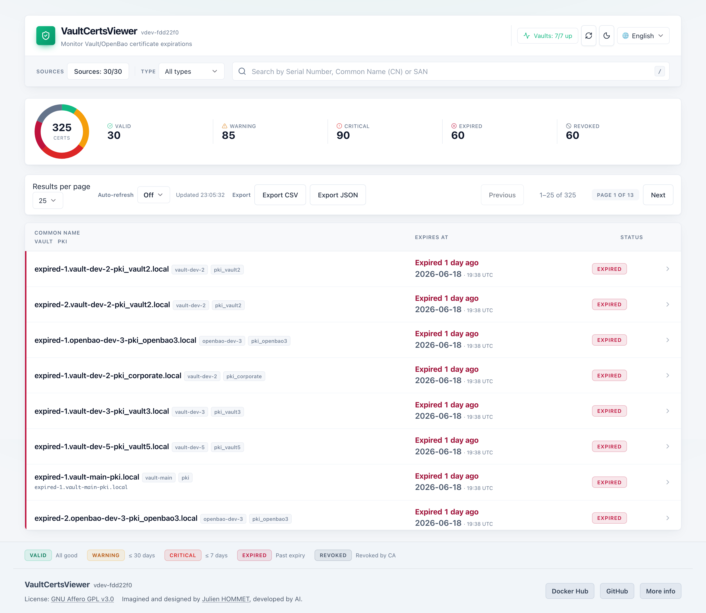
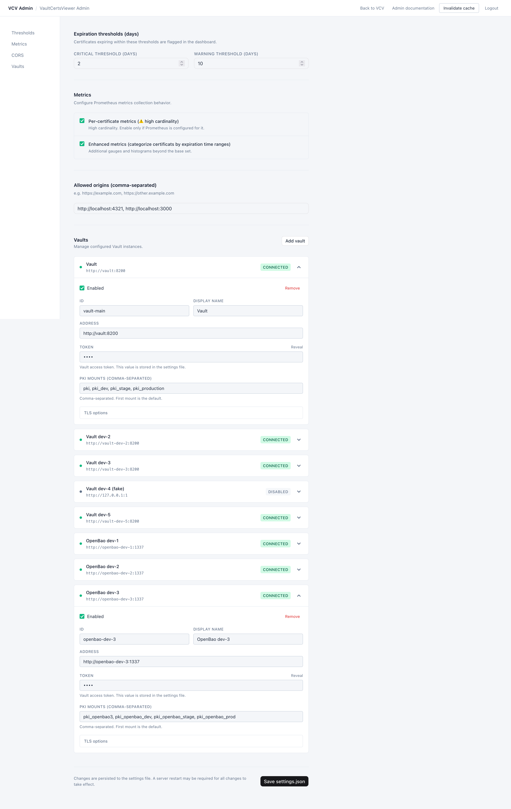
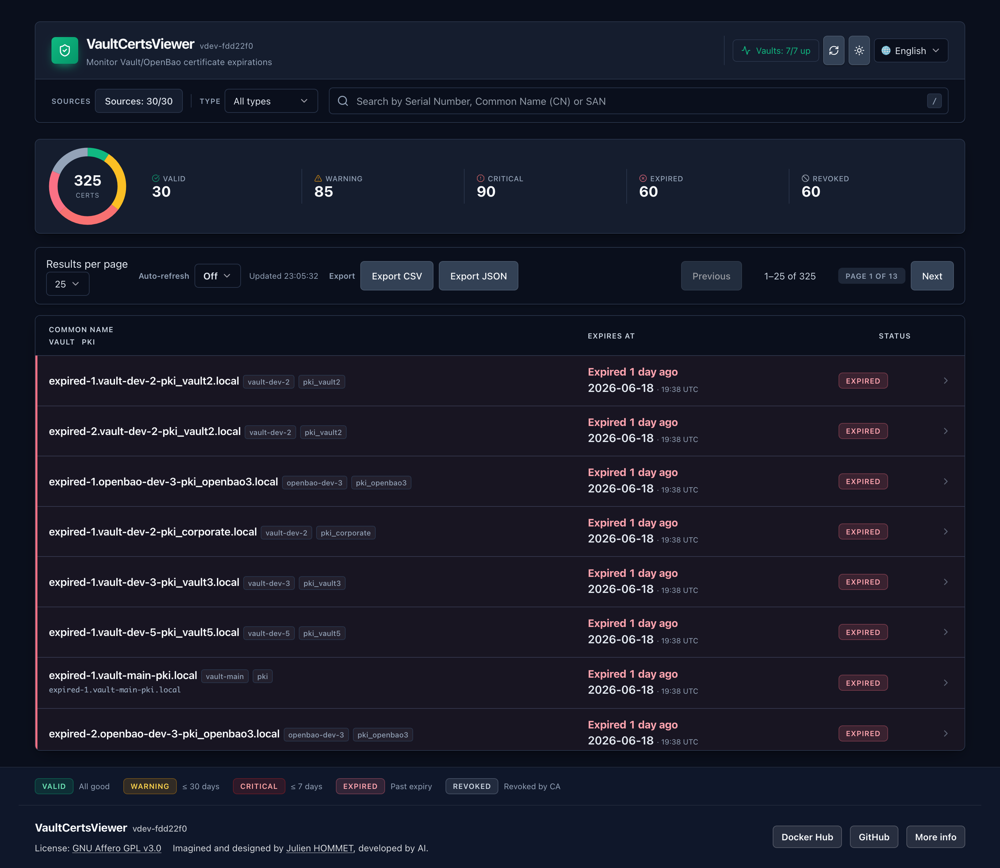
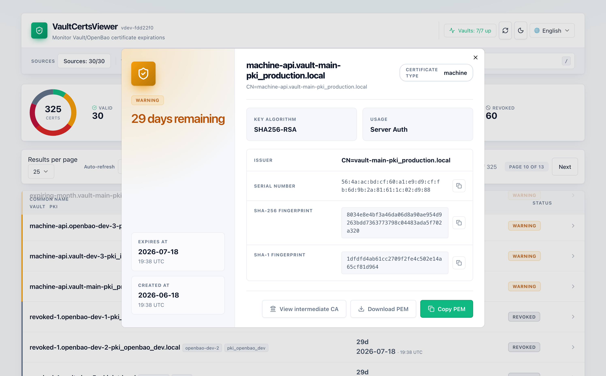
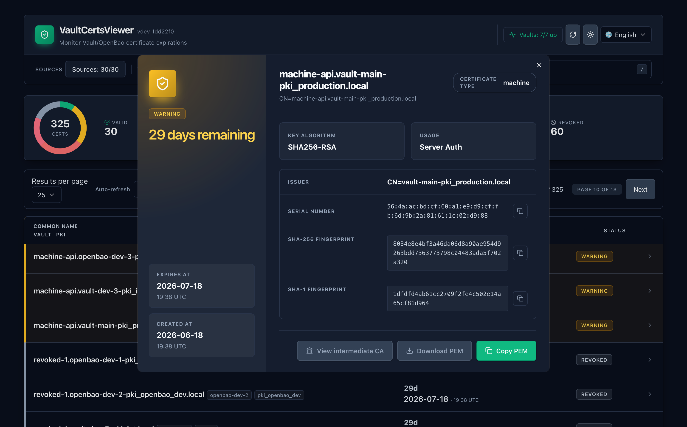

# VaultCertsViewer 🔐

 

VaultCertsViewer (vcv) is a lightweight web UI that lists and inspects certificates stored in one or more HashiCorp Vault or OpenBao PKI mounts, especially their expiration dates and SANs.

VaultCertsViewer can simultaneously monitor multiple PKI engines through a single interface, with a modal selector to choose which mounts to display. With its `settings.json` file configuration, VCV can connect to multiple Vault/OpenBao instances and PKI mounts.

**OpenBao compatible**: VCV works seamlessly with both HashiCorp Vault and OpenBao, as they share the same PKI API. Tested with OpenBao 2.4+ and Vault 1.20+ (as of 02/2026).



## ✨ What it does?

- Discovers all certificates in one or more Vault/OpenBao PKI mounts and shows them in a searchable, filterable table.
- Multi-Vault support: connect to multiple Vault/OpenBao instances simultaneously.
- Multi-PKI engine support: enable or disable which PKI engines to display.
- Shows common names (CN) and SANs, their creation and **expiration** dates, and their status (valid / expired / revoked).
- Highlights certificates expiring soon with configurable thresholds (default: 7 days critical, 30 days warning).
- UI language (en, fr, es, de, it) and theme (light/dark) selectors.
- Admin panel: web-based configuration management (optional, bcrypt-protected).
- Prometheus metrics: see [PROMETHEUS_METRICS.md](PROMETHEUS_METRICS.md).

## 🎯 Why it exists?

The native Vault/OpenBao UI is heavy and not convenient for quickly checking certificate expirations and details.

VaultCertsViewer gives platform and security teams a fast, **read-only** view of the Vault/OpenBao certificates inventory with only the essential information.

**Deployment note:** cert and metrics APIs are intentionally unauthenticated for private-network use. See [Security & deployment assumptions](app/README.md#security--deployment-assumptions) in `app/README.md`.

## 👥 Who should use it?

- Teams operating Vault/OpenBao PKI who need visibility on their certificates.
- Operators who want a ready-to-use browser view of their certificates.

## Pictures of the app

### Light mode

Main page:


Admin page:



### Dark mode

Main page:



## Certificate detail modal

Light mode:



Dark mode:



## 🚀 How to deploy and use for Hashicorp Vault

In Hashicorp Vault, create a read-only role and token for the API to reach the target PKI engines. For multiple mounts, you can either specify each mount explicitly or use wildcard patterns:

```bash
# Option 1: Explicit mounts (recommended for production). Replace 'pki' and 'pki2' with your actual mount names.
vault policy write vcv - <<'EOF'
path "pki/certs"    { capabilities = ["list"] }
path "pki/certs/*"  { capabilities = ["read","list"] }
path "pki2/certs"   { capabilities = ["list"] }
path "pki2/certs/*" { capabilities = ["read","list"] }
path "sys/health"   { capabilities = ["read"] }
EOF

# Option 2: Wildcard pattern (for dynamic environments)
vault policy write vcv - <<'EOF'
path "pki*/certs"    { capabilities = ["list"] }
path "pki*/certs/*"  { capabilities = ["read","list"] }
path "sys/health"     { capabilities = ["read"] }
EOF

vault write auth/token/roles/vcv allowed_policies="vcv" orphan=true period="24h"
vault token create -role="vcv" -policy="vcv" -period="24h" -renewable=true
```

This dedicated token limits permissions to certificate listing/reading, can be renewed, and is used in the `settings.json` file.

## 🚀 How to deploy and use for OpenBao

In OpenBao, create a read-only role and token for the API to reach the target PKI engines. The commands are similar to Vault but use the `bao` CLI:

```bash
# Option 1: Explicit mounts (recommended for production). Replace 'pki' and 'pki2' with your actual mount names.
bao policy write vcv - <<'EOF'
path "pki/certs"    { capabilities = ["list"] }
path "pki/certs/*"  { capabilities = ["read","list"] }
path "pki2/certs"   { capabilities = ["list"] }
path "pki2/certs/*" { capabilities = ["read","list"] }
path "sys/health"   { capabilities = ["read"] }
EOF

# Option 2: Wildcard pattern (for dynamic environments)
bao policy write vcv - <<'EOF'
path "pki*/certs"    { capabilities = ["list"] }
path "pki*/certs/*"  { capabilities = ["read","list"] }
path "sys/health"     { capabilities = ["read"] }
EOF

bao write auth/token/roles/vcv allowed_policies="vcv" orphan=true period="24h"
bao token create -role="vcv" -policy="vcv" -period="24h" -renewable=true
```

This dedicated token limits permissions to certificate listing/reading, can be renewed, and is used in the `settings.json` file.

## 🧩 Multi-PKI engine support

VaultCertsViewer can monitor multiple PKI engines simultaneously through a single web interface:

- **Mount selection**: Click the "Certificates sources" button in the header to open a modal showing all available PKI engines
- **Real-time counts**: Each mount displays a badge showing the number of certificates it contains
- **Flexible configuration**: Specify mounts using comma-separated values in `settings.json` (e.g., `pki,pki2,pki-prod`) or via the admin interface.
- **Multi-Vault support**: Connect to multiple Vault/OpenBao instances simultaneously via `settings.json`
- **Dashboard**: All selected mounts are aggregated in the same table, dashboard, and metrics
- **Real-time search**: Instant filtering as you type in the search box with 300ms debouncing
- **Status filtering**: Quick filters for valid/expired/revoked certificates
- **Partitioning**: Visualize certificate partitioning by expiration date
- **Pagination**: Configurable page size (25/50/100/all) with navigation controls
- **Sort options**: Sort by vault, PKI mount, common name, creation or expiration date

### 🐳 docker-compose

The recommended way to configure vcv is via a `settings.json` file.

1. Copy the example file and edit it:

```bash
cp settings.example.json settings.json
```

1. Mount it into the container under `/app/settings.json` and start:

```bash
docker compose up -d
```

If you set `app.logging.output` to `file` or `both`, you must mount a writable log path:

```bash
-v "$(pwd)/logs:/var/log/app:rw"
```

### 🐳 docker run

Start the container with this command:

```bash
docker run -d \
  -v "$(pwd)/settings.json:/app/settings.json:rw" \
  -v "$(pwd)/logs:/var/log/app:rw" \
  --cap-drop=ALL --read-only --security-opt no-new-privileges:true \
  -p 52000:52000 jhmmt/vcv:1.7
```

## 🔐 Vault/OpenBao TLS configuration

VCV supports configuring Vault/OpenBao TLS verification and custom CA bundles either through `settings.json`.

Per Vault or OpenBao instance (`vaults[]`), you can configure:

- **`tls_ca_cert_base64`**: base64-encoded PEM CA bundle (preferred)
- **`tls_ca_cert`**: file path to a PEM CA bundle
- **`tls_ca_path`**: directory containing CA certs
- **`tls_server_name`**: TLS SNI server name override
- **`tls_insecure`**: disables TLS verification (development only)

Precedence rules:

- If `tls_ca_cert_base64` is set, it is used and `tls_ca_cert` / `tls_ca_path` are ignored.
- Otherwise, `tls_ca_cert` / `tls_ca_path` are used (if set).

Notes:

- Base64 is not encryption. Treat your `settings.json` as sensitive.
- The base64 value must encode the PEM bytes (one or multiple `-----BEGIN CERTIFICATE-----` blocks). Both standard and raw base64 encodings are accepted.
- To encode a certificate with base64: `cat path-to-cert.pem | base64 | tr -d '\n'`

## 🛠️ Administration panel

An administration panel lets you configure some settings of the application. It is accessible via the `/admin` route and is protected by a password. To enable the administration panel, you must include an `admin` section in your `settings.json` file with a bcrypt password hash.

The following settings can be configured in the administration panel:

- Certificate expiration thresholds
- CORS
- Vault/OpenBao instances (address, port, token, TLS, PKI mounts)

The `admin.password` field must contain a **bcrypt hash** (prefix `$2a$`, `$2b$`, or `$2y$`).

If the field is missing or not a bcrypt hash, the admin route is disabled and the `/admin` page is not accessible.

## ⏱️ Certificate expiration thresholds

By default, VaultCertsViewer alerts on certificates expiring within **7 days** (critical) and **30 days** (warning). You can customize these thresholds in `settings.json` under `certificates.expiration_thresholds`.

```json
"certificates": {
  "expiration_thresholds": {
    "critical": 14,
    "warning": 60
  }
}
```

These values control:

- The color coding in the certificate table (red for critical, yellow for warning)
- The "expiring soon" count in the dashboard

## 🌍 Translations

The UI is localized in English, French, Spanish, German, and Italian. Language is selectable in the header or via `?lang=xx`.

## 📊 Export metrics to Prometheus

Metrics are exposed at `/metrics` endpoint. Expiration thresholds are configurable via `settings.json` and exposed as metrics.

**Core metrics:**

- vcv_certificates_total{vault_id, pki, status}
- vcv_certificates_expired_count
- vcv_certificates_expiring_soon_count{vault_id, pki, level} - Uses configured thresholds
- vcv_expiration_threshold_critical_days - Configured critical threshold
- vcv_expiration_threshold_warning_days - Configured warning threshold
- vcv_certificates_expiry_bucket{vault_id, pki, bucket} - Certificate distribution by time range
- vcv_vault_connected{vault_id}
- vcv_vault_list_certificates_success{vault_id}
- vcv_vault_list_certificates_error{vault_id}
- vcv_vault_list_certificates_duration_seconds{vault_id}
- vcv_certificates_partial_scrape{vault_id}
- vcv_vaults_configured
- vcv_pki_mounts_configured{vault_id}
- vcv_cache_size
- vcv_certificates_last_fetch_timestamp_seconds
- vcv_certificate_exporter_last_scrape_success
- vcv_certificate_exporter_last_scrape_duration_seconds

**Per-certificate metrics** (high cardinality, disabled by default):

- vcv_certificate_expiry_timestamp_seconds{certificate_id, common_name, status, vault_id, pki}
- vcv_certificate_days_until_expiry{certificate_id, common_name, status, vault_id, pki}

**Configuration:**

Enhanced metrics can be configured via `settings.json` file or the admin panel:

```json
{
  "metrics": {
    "per_certificate": false,
    "enhanced_metrics": true
  }
}
```

Complete metrics reference: [Complete metrics reference](PROMETHEUS_METRICS.md).

Example of metrics can be found in [METRICS_EXAMPLE.txt](METRICS_EXAMPLE.txt).

To scrape metrics, add this to your Prometheus configuration (example with VCV running on port 52000):

```yaml
scrape_configs:
  - job_name: vcv
    static_configs:
      - targets: ["<your-vcv-host>:52000"]
    metrics_path: /metrics
```

Do not forget to update the `targets` with your VCV host and port.

## 🛎️ Alerting with AlertManager

See [ALERTING.md](ALERTING.md) for alerting configuration.

### Security Features

- **Rate limiting**: Enabled in production mode (300 requests/minute, exempting health/ready/metrics endpoints)
- **CSRF protection**: All state-changing requests require CSRF tokens
- **Security headers**: Includes HSTS, X-Frame-Options, X-Content-Type-Options, CSP
- **Request ID tracking**: All requests include unique IDs for log correlation
- **Body size limits**: 1MB maximum request body size

## 🔎 More details

- Technical documentation: [app/README.md](app/README.md)
- French overview: [README.fr.md](README.fr.md)
- Docker hub: [jhmmt/vcv](https://hub.docker.com/r/jhmmt/vcv)
- Source code: [github.com/julienhmmt/vcv](https://github.com/julienhmmt/vcv)
